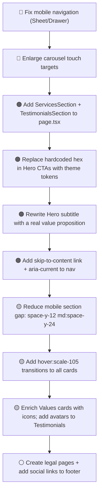

# Design Review Results: Landing Page (/)

**Review Date**: 2026-03-03  
**Route**: `/` — `apps/web/src/app/(marketing)/page.tsx`  
**Focus Areas**: All — Visual Design, UX/Usability, Responsive/Mobile, Accessibility, Micro-interactions/Motion, Consistency, Performance

---

## Summary

The Transmeet landing page has a strong visual identity and a well-structured component hierarchy. The hero section is impressive with its animated carousel and CTA buttons. However, there are **critical gaps in mobile navigation** (no menu opens on tap), **theme token inconsistencies** in the hero, **built components left out of the page**, and several accessibility issues that need to be addressed before a production launch.

---

## Issues

| # | Issue | Criticality | Category | Location |
|---|-------|-------------|----------|----------|
| 1 | **Mobile nav is non-functional** — The hamburger `≡` icon is visible on small screens but no Sheet/Drawer/overlay menu is implemented. Clicking it does nothing, leaving mobile users unable to navigate. | 🔴 Critical | Responsive / UX | `apps/web/src/components/layout/PublicHeader.tsx:44–64` |
| 2 | **Carousel dot touch targets too small** — Indicator dots are `h-2 w-2` (8px) or `h-2 w-6` (8×24px) on mobile, far below the WCAG 2.5.5 minimum of 44×44px for touch targets. | 🔴 Critical | Accessibility | `apps/web/src/components/landing/HeroSection.tsx:125–137` |
| 3 | **ServicesSection and TestimonialsSection not rendered** — Both components are fully built but are never imported or used in `page.tsx`, hiding significant content from users. | 🟠 High | UX | `apps/web/src/app/(marketing)/page.tsx:1–23` |
| 4 | **Hero CTA buttons use hardcoded hex colors** — `bg-[#e0a842] text-[#012767] hover:bg-[#e0a842]/90` bypasses the design system. Should use `bg-accent text-accent-foreground hover:bg-accent/90` from the theme. | 🟠 High | Consistency / Visual | `apps/web/src/components/landing/HeroSection.tsx:79–98` |
| 5 | **Hero subtitle is too thin** — `<motion.p>` only displays "Commandez votre camion" (3 words). This is not a proper value-proposition subtitle; it duplicates the CTA button label and adds no information. | 🟠 High | UX / Visual | `apps/web/src/components/landing/HeroSection.tsx:64–71` |
| 6 | **No skip-to-content link** — Keyboard-only and screen-reader users cannot bypass the sticky header and jump directly to the main content. Required for WCAG 2.1 Level AA (SC 2.4.1). | 🟠 High | Accessibility | `apps/web/src/app/(marketing)/layout.tsx` |
| 7 | **Active nav links missing `aria-current="page"`** — Visual active state is applied via CSS class only; assistive technologies cannot identify the current page link. | 🟠 High | Accessibility | `apps/web/src/components/layout/PublicHeader.tsx:51–63` |
| 8 | **`space-y-24` section gap is excessive on mobile** — 96px of vertical space between every section creates a very long, scroll-heavy page on small devices. Should reduce to `space-y-12 md:space-y-24`. | 🟡 Medium | Responsive / Visual | `apps/web/src/app/(marketing)/page.tsx:12` |
| 9 | **TruckTypesSection renders 6 columns on desktop** — `lg:grid-cols-6` with icon-only cards produces very narrow cards (~140px each) that feel cramped. `lg:grid-cols-3` or `xl:grid-cols-6` would be more appropriate. | 🟡 Medium | Visual / Responsive | `apps/web/src/components/landing/TruckTypesSection.tsx:23` |
| 10 | **ExpediteursTeaser copy mismatch** — Card body says "Inscrivez-vous et votre équipe vous recontactera" (passive) while the CTA says "Commander votre camion" (active). The messaging creates a mismatch in user expectation. | 🟡 Medium | UX | `apps/web/src/components/landing/ExpediteursTeaser.tsx:18–27` |
| 11 | **No hover:scale micro-interaction on most cards** — BTP cards, Services cards, Values cards, and Testimonials cards only have `hover:shadow-md`. The design brief calls for `hover:scale-105 transition-all duration-300` for a premium feel, but only BTP section partially implements it. | 🟡 Medium | Micro-interactions | `apps/web/src/components/landing/BTPTeaser.tsx:51`, `ValuesSection.tsx:36`, `TestimonialsSection.tsx:45` |
| 12 | **Testimonials lack reviewer avatar** — Three testimonial cards have no photo or avatar. Anonymous quotes with only job title and company feel low-trust for a B2B platform. A placeholder avatar (e.g., initials) would improve credibility significantly. | 🟡 Medium | UX / Visual | `apps/web/src/components/landing/TestimonialsSection.tsx:24–62` |
| 13 | **Values section cards have no icon or visual anchor** — Three value cards (Éthique, Excellence, Innovation) are text-only with no icon or color accent, making them visually indistinguishable from each other at a glance. | 🟡 Medium | Visual Design | `apps/web/src/components/landing/ValuesSection.tsx:21–52` |
| 14 | **HTML entities in JS string literals inside ServicesSection** — `"l&apos;UEMOA"` in a JavaScript string array is not decoded by React and would render literally. Should use `"l'UEMOA"` (actual apostrophe). | 🟡 Medium | Consistency | `apps/web/src/components/landing/ServicesSection.tsx:17` |
| 15 | **WhatsApp header button hidden on mobile** — The accent "WhatsApp" CTA in the header is only accessible via the desktop nav. Mobile users (who predominantly use WhatsApp) can't see it. Should be accessible in mobile menu. | 🟡 Medium | Mobile / UX | `apps/web/src/components/layout/PublicHeader.tsx:73–80` |
| 16 | **All carousel images are simultaneously in the DOM** — All 4 carousel images are rendered at once via absolute positioning with opacity toggling. This means all images are downloaded on initial load. Consider lazy-loading non-active slides. | 🟡 Medium | Performance | `apps/web/src/components/landing/HeroSection.tsx:32–51` |
| 17 | **Footer legal links likely 404** — Links to `/mentions-legales`, `/politique-confidentialite`, and `/cookies` are in the footer but these routes don't appear in the app directory. | ⚪ Low | UX | `apps/web/src/components/layout/PublicFooter.tsx:77–96` |
| 18 | **No social media links in footer** — For a B2B marketplace in West Africa targeting WhatsApp-first users, the footer misses LinkedIn, Facebook, and WhatsApp deep link. | ⚪ Low | UX | `apps/web/src/components/layout/PublicFooter.tsx` |
| 19 | **Testimonials `<blockquote>` not wrapped in `<figure>`** — The `<blockquote>` + `<figcaption>` pair should be wrapped in a `<figure>` element for correct semantic HTML. Currently `<figcaption>` is a sibling of `<blockquote>` inside a `
`. | ⚪ Low | Accessibility | `apps/web/src/components/landing/TestimonialsSection.tsx:47–54` |
| 20 | **No page-level `lang` attribute verified** — The app serves French content; `<html lang="fr">` must be confirmed in the root layout to ensure screen readers use the correct pronunciation/language. | ⚪ Low | Accessibility | `apps/web/src/app/layout.tsx` |

---

## Criticality Legend

- 🔴 **Critical** — Breaks functionality or violates accessibility standards; must fix before launch
- 🟠 **High** — Significantly impacts user experience or design quality; fix in next sprint
- 🟡 **Medium** — Noticeable issue that should be addressed soon
- ⚪ **Low** — Nice-to-have improvement or minor polish

---

## Next Steps (Suggested Priority Order)

